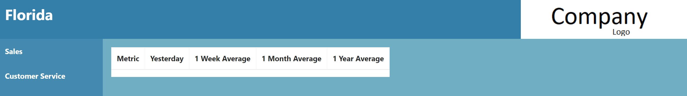
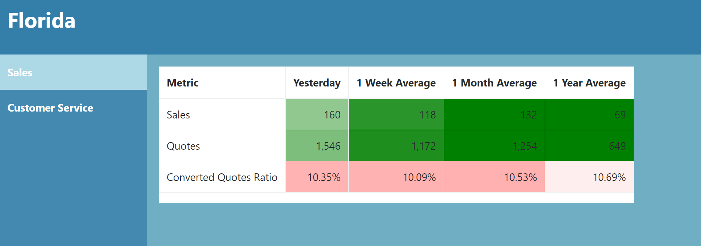
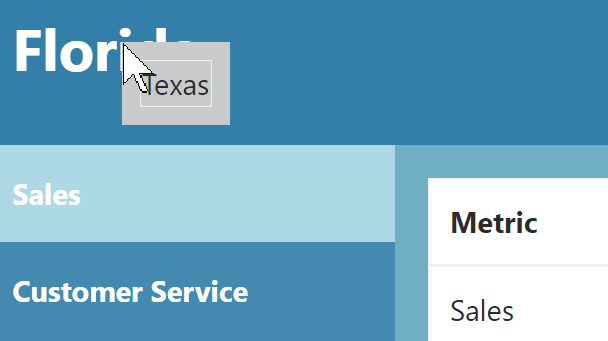
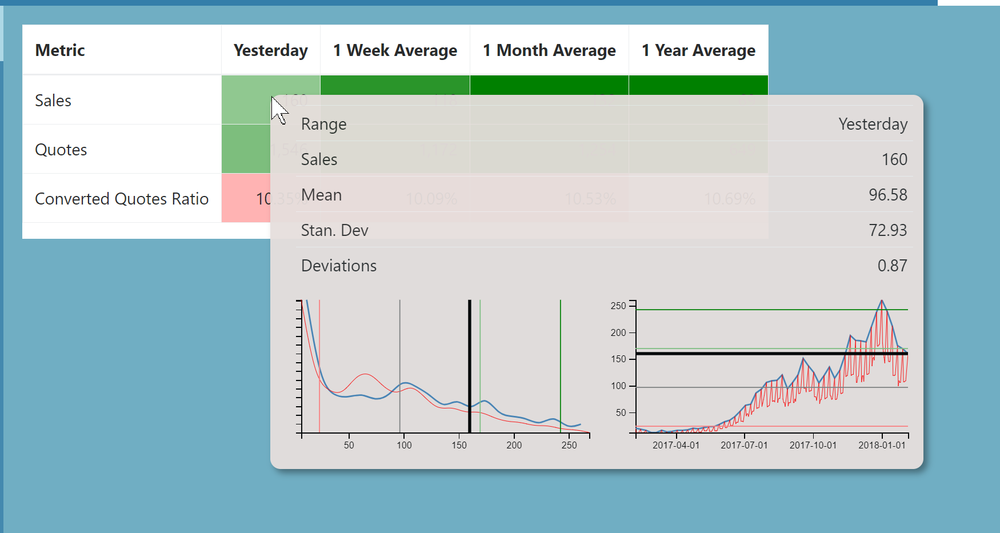

# Interactive Daily Dashboard

[Link](https://htmlpreview.github.io/?https://github.com/jjburke3/interactive_dashboard/blob/master/index.html)

This dashboard was meant to display key metrics on a daily basis.  It originally pulled directly from a SQL database using a PHP connection (I've left the PHP files included with credentials scrubbed)

The page contains all data on load, but is not displaying it yet

Once you click on a heading on the left select bar, the data from that subset will be displayed.  The data is color coded based on deviation from prior results, with green indicating good number and red indicating bad number

If you click on the state heading in the top left corner, you are given the option of looking at data for different states

When you scroll over a cell in the table, you are given the mean and standard deviation for prior results, along with two graphs, except for yearly numbers.  The first graph is a distribution of prior results, and the second graph is a time series.  The colored bars on the graphs indicate deviations from the mean, and the black bar is the current time periods result.  For daily numbers, the black line indicates results from same day of the week, and red indicates all prior weekdays

## Built With

* [d3.js](https://d3js.org/) - Javascript Library for Manipulating Data
* [Bootstrap](https://getbootstrap.com/) - Frontend Webframe Work
* [jQuery](https://jquery.com/) - Javascript Library for simiplfying javascript commands

